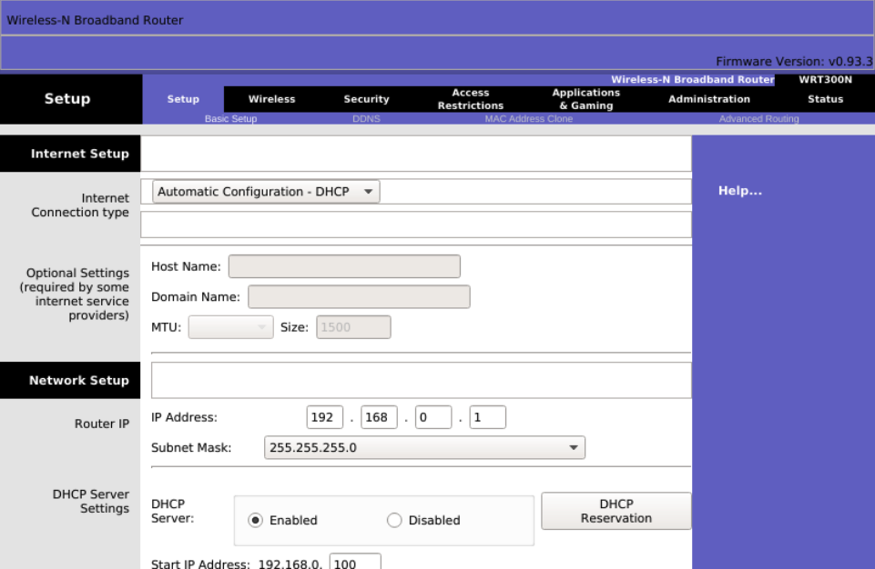
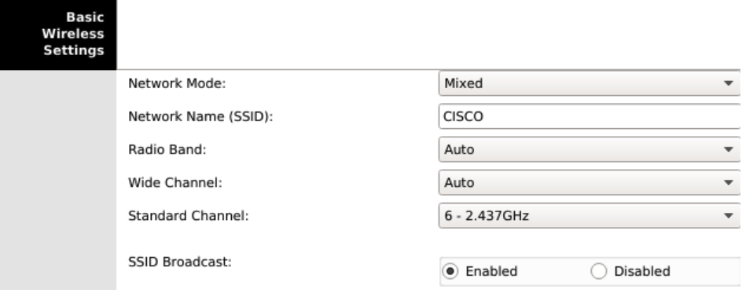
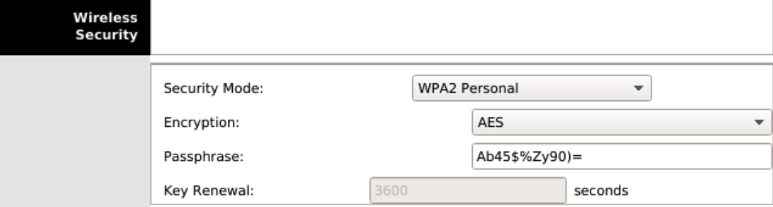
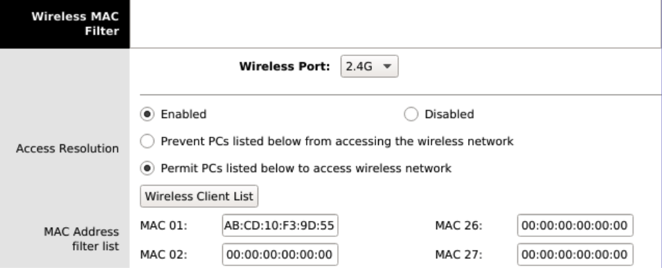

# Práctica 2.10 - Redes inalámbricas

## Configuración del router WRT300N

El router inalámbrico WRT300N de Cisco cuenta con una interfaz web para su configuración. Dado que tiene activado por defecto un servidor DHCP, podemos conectar un ordenador a cualquiera de las interfaces Ethernet del router para que este obtenga parámetros IP que permitan la conexión con el router. Una vez que nuestro PC haya recibido una dirección IP del router, abrimos un navegador y escribimos en la barra de direcciones http://192.168.0.1.

Antes de acceder al router, se nos pedirá autenticarnos. Aparecerá un formulario de incio de sesión en el que debemos ingresar el nombre de usuario administrador y la contraseña. Si el router es nuevo o ha sido reiniciado a valores de fábrica, el usuario administrador por defecto es admin y la contraseña también es admin. Una vez autenticados, deberíamos ver la siguiente pantalla:

{ width="700" }

### Parámetros Wi-Fi

Una red WLAN tiene los siguientes parámetros configurables:

- SSID (Service Set Identifier): Es una cadena alfanumérica de hasta 32 caracteres que identifica a la red.
- Protocolo: Especifica la versión del estándar 802.11 que utilizaremos.
- Canal: Frecuencia de transmisión utilizada.
- Seguridad: Parámetros que afectan tanto a la autenticación del cliente inalámbrico con el punto de acceso como al cifrado de las comunicaciones. Estos se abordarán en una sección posterior.

Para configurar los parámetros de la red inalámbrica, debemos hacer clic en el enlace Wireless del menú principal. Desde aquí, especificaremos los siguientes valores:

- Network Mode: Indica la versión del estándar 802.11 que utilizará la WLAN. Las opciones disponibles son:
- Mixed: Para redes con dispositivos de diferentes estándares.
- BG-Mixed: Permite la conexión de dispositivos 802.11b y 802.11g, que son compatibles entre sí.
- Wireless-B Only: Solo conecta dispositivos que operan bajo 802.11b.
- Wireless-G Only: Solo conecta dispositivos que operan bajo 802.11g.
- Wireless-N Only: Solo conecta dispositivos que operan bajo 802.11n.
- Disabled: Deshabilita la red inalámbrica.
- SSID: Es el identificador de nuestra red, por ejemplo, CISCO. Todos los clientes inalámbricos reconocerán esta red por este SSID. Si dejamos activado SSID Broadcast, este nombre se difundirá por la red.
- Radio Band: Indicamos si usaremos canales de 20 MHz o 40 MHz. Esta opción solo está disponible si en el modo de red hemos seleccionado el estándar 802.11n.
- Wide Channel: Establecemos el canal de emisión en caso de haber seleccionado 40 MHz en el campo anterior.
- Standard Channel: Canal o frecuencia de emisión. Es muy importante asegurarnos de utilizar uno que tenga una separación mínima de 5 canales (o 25 MHz) respecto a los canales de operación de otras redes inalámbricas cercanas, para evitar solapamientos de señal e interferencias. En caso de emplear 802.11n, este canal es secundario para aumentar la tasa de transmisión.
- SSID Broadcast: Establece si se difunde o no el nombre de la red en el entorno para que los clientes puedan conectarse.

Una vez establecidos estos parámetros, debemos hacer clic en el botón Save Settings en la parte inferior de la pantalla.

{ width="700" }

### Servidor DHCP

Los clientes de la red, tanto inalámbricos como cableados, necesitarán configurar sus parámetros IP para que los usuarios o el administrador no tengan que hacerlo manualmente. Para ello, el router WRT300N incluye un servidor DHCP que podemos configurar según nuestras necesidades. Los pasos a seguir son los siguientes:

1. Acceder a la interfaz web de configuración del router y autenticarse como administrador.
2. En la primera opción del menú, Setup, encontraremos el apartado Network Setup desde donde podremos configurar tanto la dirección IP de LAN del router como los parámetros del servidor DHCP.
3. En el campo Router IP, indicar la dirección IP y la máscara de subred del router en la LAN. Por ejemplo, 192.168.1.1 con máscara 255.255.255.0. Recordemos que las LAN operan internamente con direcciones privadas, por lo que podemos utilizar cualquier red dentro del rango de redes privadas establecido.
4. En el campo Start IP Address, indicar la primera dirección IP que se asignará a los dispositivos de la red.
5. En el campo Maximum Number of Users, establecer el número máximo de direcciones IP que se asignarán. La primera será la que se haya establecido en el campo anterior, y sumando a esta el valor indicado aquí se obtendrá la última dirección.

No es necesario especificar un servidor DNS en la configuración del rango de direcciones del servidor DHCP, ya que el router asignará el mismo que haya obtenido de la conexión a Internet.

{ width="700" }

Si hemos cambiado la red en la que operaba por defecto el router (192.168.0.0/24), quedaremos desconectados, ya que nuestros parámetros IP pertenecían a la red anterior. Por lo tanto, debemos cerrar el navegador, renovar la configuración de red en nuestro PC desactivando y reactivando la tarjeta de red, y volver a conectar con la interfaz web de configuración del router para continuar. Esta vez, en el navegador deberemos ingresar la dirección IP de LAN que asignamos al router, en nuestro caso 192.168.1.1.

### Seguridad en la WiFi

En esta sección, veremos cómo establecer una seguridad básica en nuestro router para evitar conexiones no autorizadas. Los pasos a seguir son:

1. Acceder a la interfaz web de configuración del router y autenticarse como administrador.
2. En el menú, ir a Wireless → Wireless Security, desplegar la lista Security Mode y elegir WPA2 Personal.
3. En el campo Encryption, seleccionar el algoritmo AES, que es preferible a TKIP.
4. En el campo Passphrase, establecer la clave que los usuarios deben utilizar para conectar sus dispositivos a la red inalámbrica.
5. Hacer clic en el botón Save Settings en la parte inferior de la pantalla.

{ width="700" }

Una parte crucial de la seguridad de una red inalámbrica reside en la contraseña elegida. Al crear una clave inalámbrica, se recomienda:

- Que tenga una longitud mínima de ocho caracteres.
- Combinar letras (mayúsculas y minúsculas), símbolos y números.
- No utilizar palabras comunes, números o fechas.

### Filtrado MAC

Una buena práctica para aumentar la seguridad de nuestra red inalámbrica es habilitar el filtrado MAC. Esto se basa en utilizar una lista de direcciones MAC correspondientes a dispositivos de confianza. Podemos configurar esta lista en el router de manera que solo los dispositivos cuyas direcciones MAC coincidan con alguna de la lista puedan unirse a la red; en caso contrario, serán rechazados.

Para habilitar y configurar el filtrado MAC, seguir estos pasos:

1. Acceder a la interfaz web de configuración del router y autenticarse como administrador.
2. Ir a la opción de menú Wireless → Wireless MAC Filter.
3. Hacer clic en Enabled para activar el filtrado MAC.
4. Seleccionar Permit PCs listed below to access wireless network.
5. Introducir todas las direcciones MAC de los dispositivos conocidos. Aquí debemos incluir los PCs, portátiles, smartphones, tablets, etc., que queremos conectar a nuestra red.
6. Hacer clic en el botón Save Settings en la parte inferior de la pantalla.

{ width="700" }

## Descripción de la tarea

Crea un escenario con un router y 4 equipos portátiles que se conecten a él de forma inalámbrica. Documenta el proceso modificando las siguientes configuraciones:

- SSID.
- Contraseña.
- DHCP, con IPs de clase C privadas, que pertenezcan a la misma red de la puerta de enlace por defecto que muestra el router.
- Tipo de seguridad en la contraseña.
- Añade filtrado MAC, de tipo _whitelist_.
- Añade un nuevo equipo que no debería poder conectarse debido al filtrado MAC.

## Entrega

Crea un documento PDF, a partir de un Word o Google Docs, con las siguientes consideraciones:

- El nombre del archivo a entregar en la plataforma Moodle Centros debe tener el siguiente formato: `Apellido1Apellido2_Nombre_RL_UD2_P10.pdf`.
- Portada con imagen, nombre del alumno, título y curso.
- Encabezado con nombre de la práctica y materia.
- Pie de página con nombre, número de página insertado, curso, año escolar, instituto.
- Índice o tabla de contenidos generada automáticamente.
- Tipo de letra: Times New Roman 12 o similar, interlineado sencillo, espaciado anterior 6p.
- Uso correcto de la ortografía.
- Texto justificado con uso de salto de páginas correcto.
- Enlaces web de referencia cuando se coge información de un sitio web.
- Las fotos que se puedan ver correctamente al ampliarlas y que no ocupen mucho espacio.
- Insertar Título de foto que haga referencia al apartado y ejercicio correspondiente.
- Para las capturas de pantalla de Cisco Packet Tracer:
    - Se captura todo el escritorio, con el fondo de su plataforma Moodle, donde se pueda ver imagen de perfil. Toda aquella práctica que no cumpla este requisito no será evaluada.
    - Al igual que en los Títulos de las fotos, en el Título de la captura de pantalla irá referenciado el apartado y ejercicio al que corresponde.