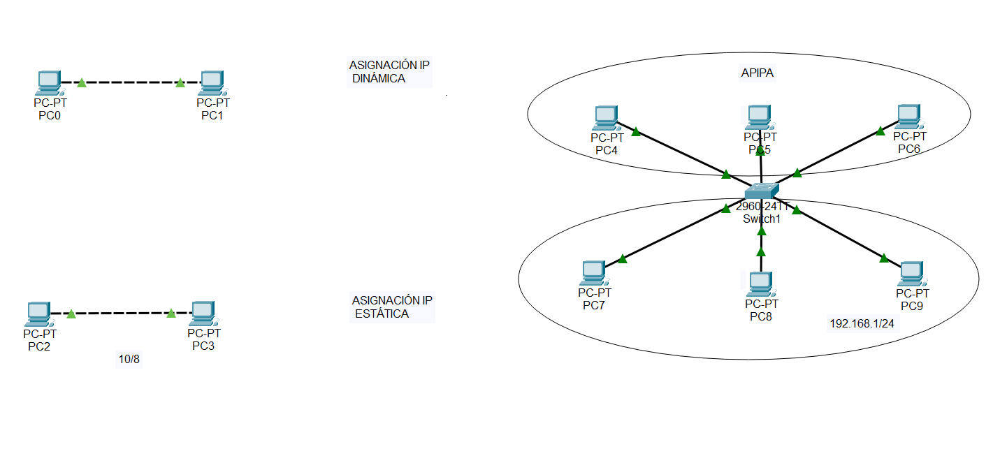

# Práctica 2.7 - Configuración de asignaciones de IPs

## Descripción de la tarea

En las redes de área local cada host necesita una dirección IPv4. Las direcciones lógicas o IPv4 se configuran en la conexión de la interfaz de red (NIC). Algunos servidores pueden tener más de una NIC, y cada una de ellas tiene su propia dirección IPv4. 

Utiliza el simulador Cisco Packet Tracer para reproducir el escenario adjunto. Configura las asignaciones IP como indican las instrucciones:

- Los equipos de la parte superior tendrán configuración IP dinámica: las tarjetas FastEthernet activarán el cliente DHCP. 
- Los equipos de la parte inferior tendrán configuración IP estática: las tarjetas FastEthernet activarán la configuración IP estática.
- Confirma la comunicación entre equipos usando los comandos ipconfig y ping.
- Confirma que dos equipos con conexión física no tienen por qué comunicarse si no están en la misma red lógica.

{ width="800" }

A continuación, realiza los siguientes comandos:

- ipconfig y ping exitoso entre PC0 y PC1
- ipconfig y ping exitoso entre PC2 y PC3
- ipconfig y ping exitoso entre PC4 y PC6
- ipconfig y ping exitoso entre PC7 y PC9 
- ipconfig y ping fallido entre PC5 y PC8

Documenta con capturas estos resultados y genera un documento .pdf con ellas.

## Entrega

Crea un documento PDF, a partir de un Word o Google Docs, con las siguientes consideraciones:

- El nombre del archivo a entregar en la plataforma Moodle Centros debe tener el siguiente formato: `Apellido1Apellido2_Nombre_RL_UD2_P7.pdf`.
- Portada con imagen, nombre del alumno, título y curso.
- Encabezado con nombre de la práctica y materia.
- Pie de página con nombre, número de página insertado, curso, año escolar, instituto.
- Índice o tabla de contenidos generada automáticamente.
- Tipo de letra: Times New Roman 12 o similar, interlineado sencillo, espaciado anterior 6p.
- Uso correcto de la ortografía.
- Texto justificado con uso de salto de páginas correcto.
- Enlaces web de referencia cuando se coge información de un sitio web.
- Las fotos que se puedan ver correctamente al ampliarlas y que no ocupen mucho espacio.
- Insertar Título de foto que haga referencia al apartado y ejercicio correspondiente.
- Para las capturas de pantalla de Cisco Packet Tracer:
    - Se captura todo el escritorio, con el fondo de su plataforma Moodle, donde se pueda ver imagen de perfil. Toda aquella práctica que no cumpla este requisito no será evaluada.
    - Al igual que en los Títulos de las fotos, en el Título de la captura de pantalla irá referenciado el apartado y ejercicio al que corresponde.