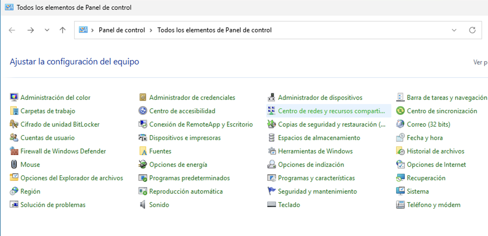
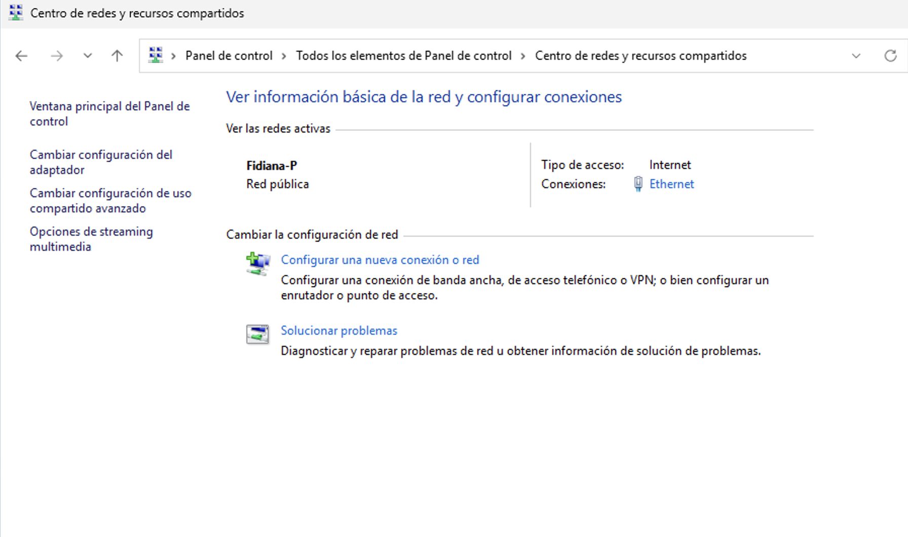
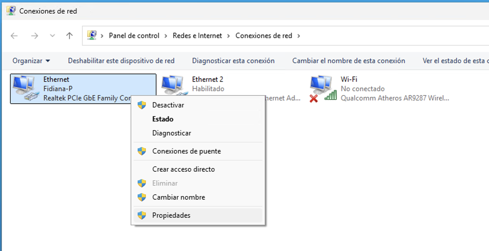
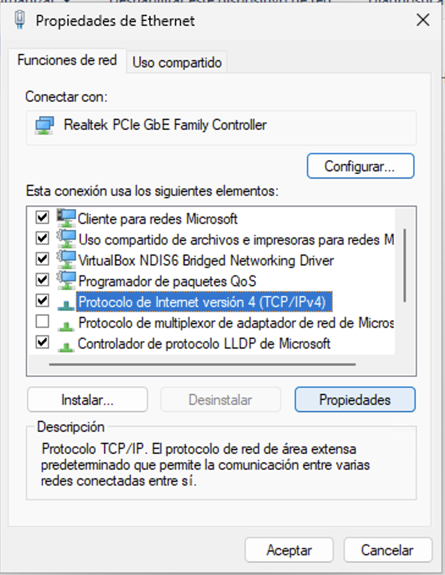
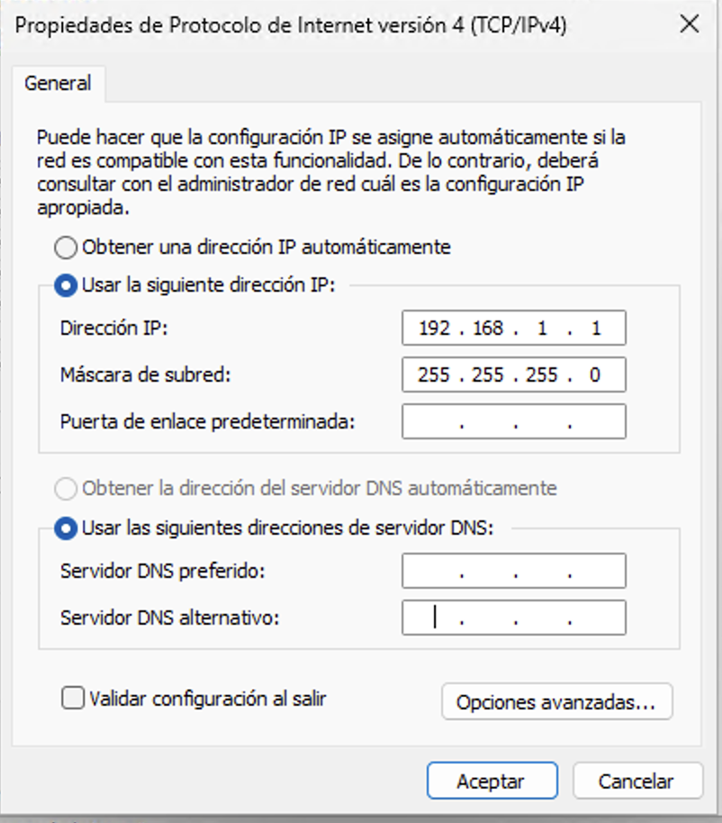
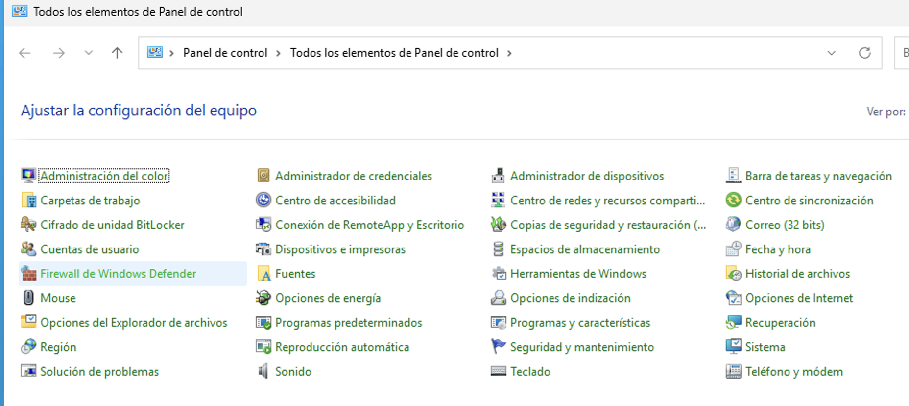
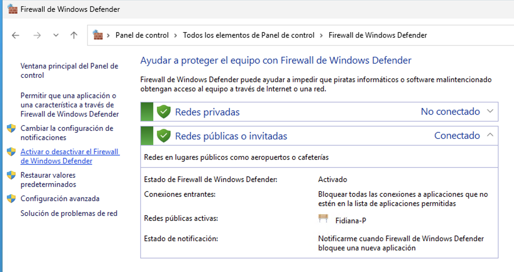
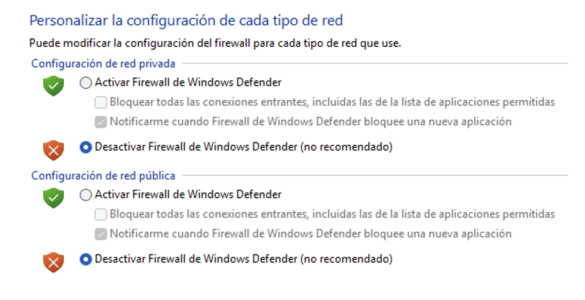
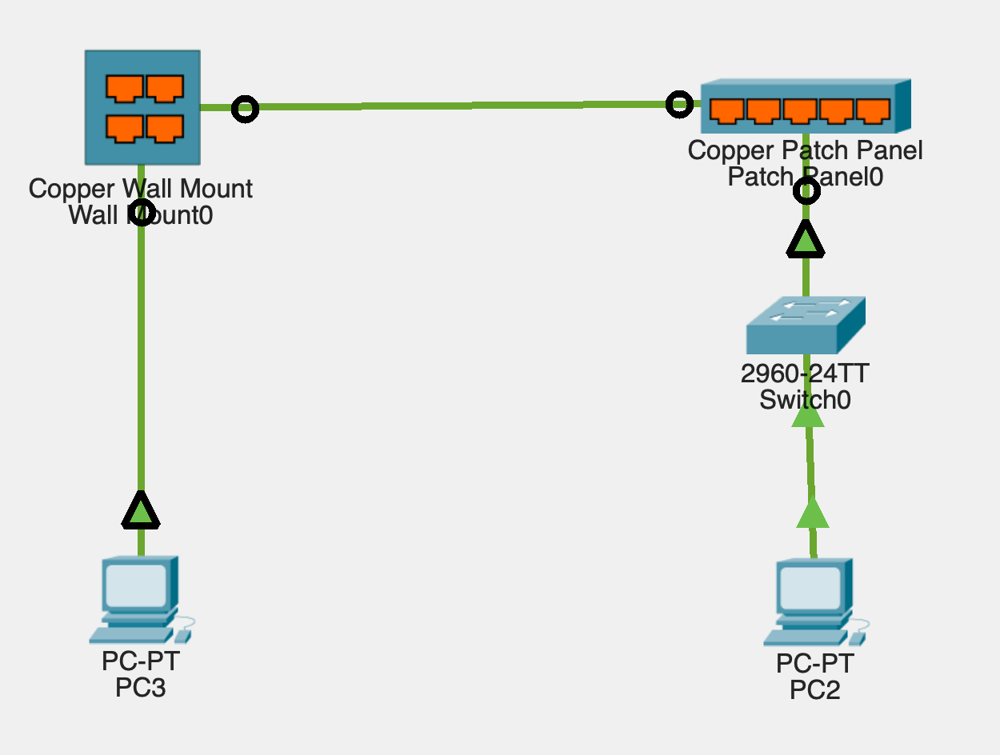

# Práctica 4.4 - Conexión de ordenadores con cables directos y cruzados

## Parte 1 - Conexión directa entre equipos

### Descripción

En esta primera parte de la práctica se comprobará el funcionamiento de los cables de red directo y cruzado mediante la conexión directa de dos ordenadores con sistema operativo Windows. Para ello, se configurarán manualmente las tarjetas de red y se verificará la conectividad mediante el comando ping.

### Materiales

- 2 ordenadores con sistema operativo Windows.
- Cable de red cruzado.
- Cable de red directo.
- Switch no configurable.

### Explicación

Tradicionalmente, para conectar directamente dos ordenadores sin dispositivos intermedios era necesario utilizar un cable cruzado, ya que permitía cruzar los pares de transmisión y recepción. Sin embargo, las tarjetas de red modernas incorporan la función Auto MDI/MDI-X, que permite adaptar automáticamente el cableado, haciendo posible la comunicación incluso utilizando un cable directo.

Para que dos equipos puedan comunicarse en una red local sin un servidor DHCP, es necesario configurar direcciones IP estáticas dentro del mismo rango de red. Además, para evitar bloqueos durante la prueba, se desactivará temporalmente el firewall de Windows.

### Desarrollo de la práctica

Se conectan directamente los dos ordenadores mediante un cable cruzado.

A continuación, se configura manualmente la tarjeta de red de cada equipo con los siguientes parámetros (a modo de ejemplo):

- Equipo 1
    - IP: 192.168.1.10
    - Máscara: 255.255.255.0
- Equipo 2
    - IP: 192.168.1.20
    - Máscara: 255.255.255.0

No se configurará puerta de enlace ni servidor DNS.

Para ello se realizan los pasos que se indican en las siguiente imágenes.

{ width="700px" }

{ width="700px" }

{ width="700px" }

{ width="500px" }

{ width="500px" }

A continuación, se desactiva temporalmente el Firewall de Windows en ambos equipos para evitar interferencias en la prueba de conectividad.

{ width="700px" }

{ width="700px" }

{ width="700px" }

Desde uno de los ordenadores se abre una consola de comandos y se ejecuta el comando ping a la dirección IP del otro equipo, comprobando que se reciben respuestas correctamente.

Tras verificar la conectividad con el cable cruzado, se sustituye éste por un cable directo y se repite el proceso de comprobación mediante ping. Se deberá comprobar que la comunicación sigue siendo posible gracias a la corrección automática de las tarjetas de red actuales.

Por último, se conectan ambos ordenadores a un switch no configurable utilizando cables directos. Se mantienen las mismas configuraciones IP y se realiza nuevamente la prueba de conectividad entre ambos equipos.

## Parte 2 – Comprobación de conectividad usando rosetas y cableado estructurado

### Descripción

En esta segunda parte de la práctica se comprobará el funcionamiento de una instalación básica de cableado estructurado utilizando rosetas, patch panel y un switch, verificando tanto la continuidad del cableado como la conectividad entre equipos finales.

### Materiales

- Cable estructurado con roseta RJ45 en un extremo.
- Patch panel RJ45.
- Switch no configurable.
- 2 ordenadores con sistema operativo Windows.
- 2 latiguillos de red.
- Tester de cableado de red.

### Explicación

El cableado estructurado se basa en la utilización de elementos intermedios como rosetas y patch panels, que permiten organizar y mantener la red de forma ordenada. Antes de conectar equipos activos, es imprescindible comprobar que el cableado funciona correctamente mediante un tester.

Una vez validada la continuidad del cable, se integrará el switch para permitir la comunicación entre los equipos, reproduciendo una situación real de red local.

### Desarrollo de la práctica

Se conecta un extremo del cable estructurado a la roseta RJ45 y el otro extremo al patch panel. Utilizando dos latiguillos, se conecta el tester al conjunto roseta–patch panel y se comprueba que el cableado es correcto, verificando la continuidad y el orden de los hilos.

Una vez comprobado el correcto funcionamiento del cable, se conecta un switch al patch panel mediante un latiguillo. A este switch se conecta uno de los ordenadores.

En el otro extremo de la instalación, el segundo ordenador se conecta directamente a la roseta de red mediante un latiguillo.

{ width="500px" }

A continuación, se configuran las tarjetas de red de ambos equipos con direcciones IP estáticas, siguiendo el mismo esquema utilizado en la primera parte de la práctica, y se desactiva temporalmente el firewall de Windows.

Finalmente, se realiza una prueba de conectividad mediante el comando ping entre ambos ordenadores, comprobando que la comunicación se establece correctamente a través de la roseta, el patch panel y el switch.

## Criterios de evaluación

Esta práctica evalúa los criterios de evaluación del RA2. Para su corrección se tendrá en cuenta:
- Configuración correcta de las tarjetas de red y comprobación de conectividad directa (30%).
- Uso correcto de cables directos y cruzados y verificación de su funcionamiento (30%).
- Comprobación del cableado estructurado con roseta y patch panel (20%).
- Documentación clara y completa del proceso con evidencias gráficas (20%).

## Entrega de la tarea

El alumnado deberá documentar todo el proceso mediante fotografías propias y una explicación detallada de cada una de las pruebas realizadas. El trabajo se entregará en formato PDF a través de la plataforma Moodle Centros con el siguiente nombre:

**Apellido1Apellido2_Nombre_RL_UD4_P4.pdf**

Además, el profesor comprobará presencialmente el correcto funcionamiento de la instalación y las pruebas de conectividad realizadas.