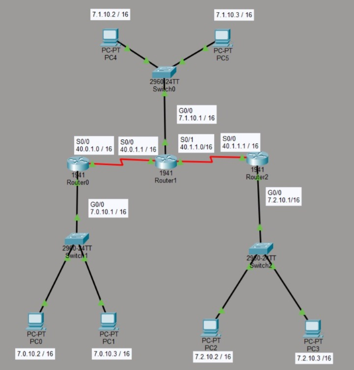

# Práctica 6.1 - Interconexión de equipos en redes de área local con Packet Tracer

## Descripción de la tarea

### Ejercicio 1

Configura la siguiente red y contesta a las preguntas.

{ width=600 }

1. Sin hacer la tabla, ¿cuantas conexiones directas esperarías de cada uno de los routers? ¿Y estáticas? Justifica tu respuesta.

2. Preparar la tabla de enrutamiento para conexiones directas y estáticas de cada uno de los routers.

3. Comprueba la conexión entre PC4 y el Router 1. ¿Puedes mandar un `ping`?

4. Con el comando `ping` prueba la conexión entre PC0 y PC5. ¿Y entre PC0 y PC3?

5. ¿Qué ocurre cuando solo configuras la conexión estática entre el Router 1 en el 0? Apoya tu explicación mandando un `ping` desde las red del router 0 al router 1.

**Se valorará positivamente todas las explicaciones que estén fundadas en capturas de pantalla y argumentos, aunque estas no sean del todo correctas**

## Criterios de calificación

- Pregunta 1.1: 1 punto.
- Pregunta 1.2: 2 puntos.
- Pregunta 1.3: 1 punto.
- Pregunta 1.4: 4 puntos.
- Pregunta 1.5: 2 puntos.

## Entrega

Crea un documento PDF, a partir de un Word o Google Docs, con las siguientes consideraciones:

- El nombre del archivo a entregar en la plataforma Moodle Centros debe tener el siguiente formato: `Apellido1Apellido2_Nombre_RL_UD6_P1.pdf`.
- Portada con imagen, nombre del alumno, título y curso.
- Encabezado con nombre de la práctica y materia.
- Pie de página con nombre, número de página insertado, curso, año escolar, instituto.
- Índice o tabla de contenidos generada automáticamente.
- Tipo de letra: Times New Roman 12 o similar, interlineado sencillo, espaciado anterior 6p.
- Uso correcto de la ortografía.
- Texto justificado con uso de salto de páginas correcto.
- Enlaces web de referencia cuando se coge información de un sitio web.
- Las fotos que se puedan ver correctamente al ampliarlas y que no ocupen mucho espacio.
- Insertar Título de foto que haga referencia al apartado y ejercicio correspondiente.