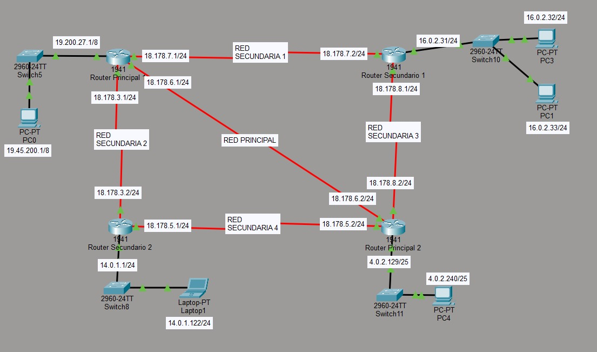

# Práctica 6.2 - Interconexión de equipos en redes de área local- Simulación con Cisco (II).

## Descripción de la tarea

### Ejercicio 

Considera la siguiente configuración de red.

{ width=700 }

1. ¿Cuántas conexiones directas esperas encontrar en la tabla de rutas de cada router? ¿Aparecerán rutas estáticas? Justifica tu respuesta (0,5 puntos).
2. Determina la dirección de red de la interfaz interna (LAN) del Router Principal 2. ¿Por qué? (1 punto)
3. Configura las tablas de enrutamiento de los routers tal que las redes secundarias 3 y 4 están desactivadas (no puede enviar ni recibir información a través de ella). Demuestramelo usando el comando `tracert` entre las conexiones del PC0-Laptop1, Laptop1-PC4 y PC3-PC4 (4 puntos).
4. Supón que se produce un corto en la red principal. Debido a ello, las redes secundarias 3 y 4 se activan para seguir manteniendo la malla. Modifica las tablas de enrutamiento de los routers para los dispositivos sigan conectados. Apoya tu explicación usando el comando `tracert` para comprobar las conexiones PC0-Laptop1, Laptop1-PC4 y PC3-PC4 (3 puntos).
5. (Pregunta de respuesta libre) ¿Encuentras una utilidad práctica a la arquitectura del apartado 1.3 y 1.4? Inventate un supuesto que permita usar esta disposición (1,5 puntos).

**Se valorará positivamente todas las explicaciones que estén fundadas en capturas de pantalla y argumentos, aunque estas no sean del todo correctas**

**En caso de detectarse IA para redactar los apartados, el profesor se reservará la posibilidad de invalidar la práctica**

## Entrega

Crea un documento PDF, a partir de un Word o Google Docs, con las siguientes consideraciones:

- El nombre del archivo a entregar en la plataforma Moodle Centros debe tener el siguiente formato: `Apellido1Apellido2_Nombre_RL_UD6_P2.pdf`.
- Portada con imagen, nombre del alumno, título y curso.
- Encabezado con nombre de la práctica y materia.
- Pie de página con nombre, número de página insertado, curso, año escolar, instituto.
- Índice o tabla de contenidos generada automáticamente.
- Tipo de letra: Times New Roman 12 o similar, interlineado sencillo, espaciado anterior 6p.
- Uso correcto de la ortografía.
- Texto justificado con uso de salto de páginas correcto.
- Enlaces web de referencia cuando se coge información de un sitio web.
- Las fotos que se puedan ver correctamente al ampliarlas y que no ocupen mucho espacio.
- Insertar Título de foto que haga referencia al apartado y ejercicio correspondiente.