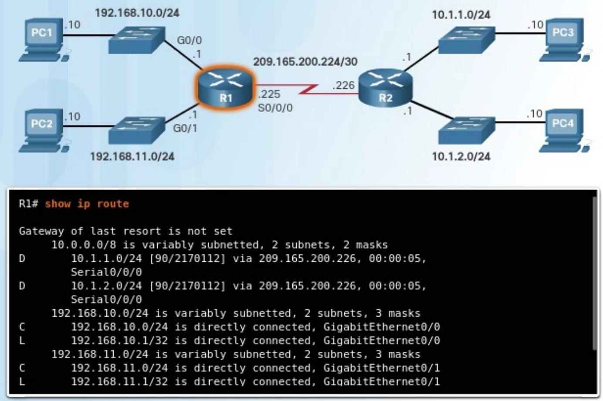
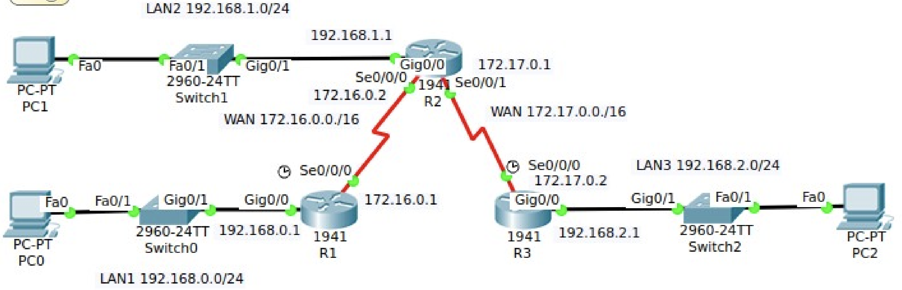
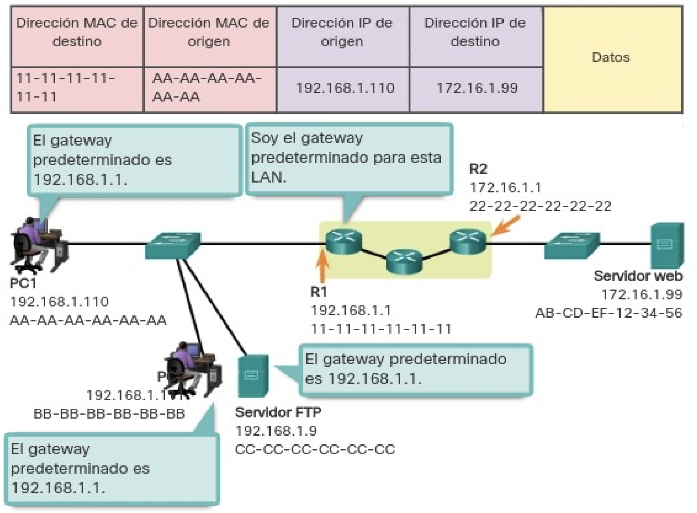
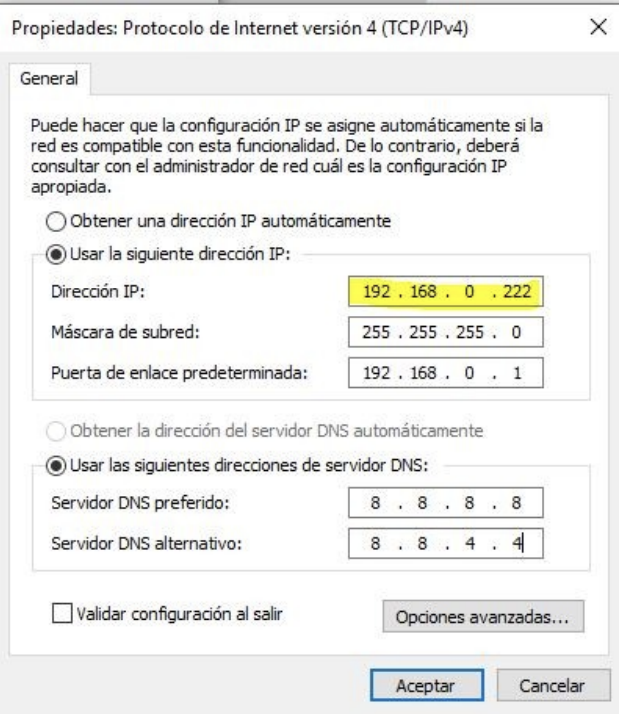
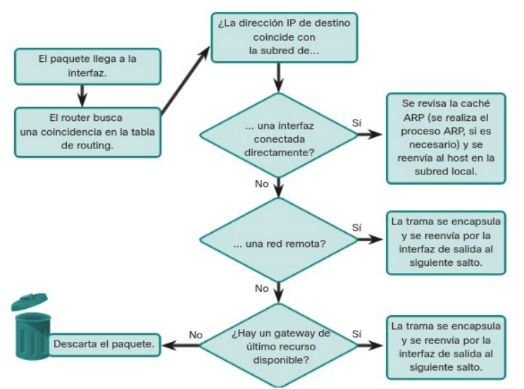
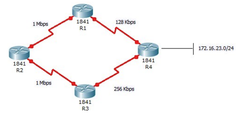

# Unidad 6 - Interconexión de equipos en redes de área local

## Encaminamiento

Además del direccionamiento, que ya vimos en la unidad 2, la capa de red se encarga de encaminar los paquetes entre distintos hosts. Un host puede enviar un paquete a diferentes destinos posibles:

- A sí mismo. Es posible que un host se envíe datos a su propia dirección, utilizando la dirección IPv4 127.0.0.1, conocida como “interfaz de loopback” o bucle invertido.
- A un host dentro de la misma red. En este caso, el host de destino forma parte de la misma red local que el emisor, ya que comparten el mismo identificador de red. Por ejemplo, en una red doméstica pueden coexistir varios dispositivos conectados por cable o de forma inalámbrica, enlazados mediante un dispositivo intermediario como un switch LAN o un punto de acceso Wi-Fi. Este equipo actúa como puente entre los dispositivos de la misma red local. Si el host de origen envía un paquete a otro equipo dentro de la misma red IP, el paquete se transmite a través del intermediario directamente hacia su destino.
- A un host en otra red. Aquí hablamos de un equipo que se encuentra en una red distinta a la del emisor, por lo que no comparten el mismo prefijo de red. En estos casos, los routers se encargan de enlazar distintas redes entre sí. Son los responsables de trasladar los paquetes entre redes diferentes.

En la mayoría de los casos, los dispositivos necesitan comunicarse más allá de su red local, por ejemplo, al acceder a servicios en Internet. Cuando esto ocurre, es fundamental el uso de routers y del proceso de enrutamiento. El enrutamiento consiste en determinar la mejor ruta posible para hacer llegar un paquete a su destino final.

### Puerta de enlace

El router que se encuentra conectado a la red local recibe el nombre de puerta de enlace predeterminada o gateway por defecto. Este dispositivo tiene la función de dirigir el tráfico de datos hacia redes externas, es decir, fuera del ámbito de la red local.

En la mayoría de los sistemas, la tabla de enrutamiento del host incluye una entrada correspondiente a esta puerta de enlace. La dirección IPv4 del gateway puede ser asignada automáticamente mediante el protocolo DHCP o bien configurarse manualmente por el usuario o administrador. Por ejemplo, en la ilustración, tanto el PC1 como el PC2 están configurados con la dirección 192.168.10.1 como gateway predeterminado. Esta configuración genera en la tabla de enrutamiento de cada equipo una ruta predeterminada, que será utilizada para enviar paquetes dirigidos a destinos fuera de su red local.

Esta ruta predeterminada se deriva directamente de la dirección configurada como gateway y aparece en la tabla de enrutamiento del host. De este modo, tanto el PC1 como el PC2 enviarán cualquier tráfico destinado a redes remotas al router R1, siguiendo la ruta predeterminada definida.

### Tablas de enrutamiento

Una tabla de enrutamiento es una estructura de datos que almacena información sobre los posibles caminos que pueden seguir los paquetes para alcanzar un destino. El componente más importante de dicha tabla es la ruta, que identifica una red de destino junto con la dirección IP del siguiente salto, es decir, el router al que se debe enviar el paquete para continuar su trayecto.

Estas tablas están formadas por múltiples rutas y son únicas en cada dispositivo. Todos los equipos conectados a una red —ya sean PCs, routers, etc.— disponen de su propia tabla de enrutamiento. Cuando un dispositivo necesita enviar datos a otro, consulta esta tabla para determinar cuál es el mejor camino a seguir.

El funcionamiento básico de una tabla de enrutamiento se resume en los siguientes pasos:

1.	Un paquete llega al dispositivo o es generado por él (por ejemplo, un PC, router o tablet).
2.	El sistema operativo del dispositivo analiza la dirección IP de destino para identificar la red de destino y busca la ruta correspondiente en su tabla de enrutamiento.
3.	Una vez localizada la ruta, se obtiene la dirección IP del router que corresponde al siguiente salto.
4.	El paquete se envía a esa dirección, es decir, al siguiente dispositivo en la ruta hacia su destino final.

Este proceso se repite para cada paquete que debe ser transmitido por la red.

Cuando un host necesita enviar un paquete, utiliza su propia tabla de enrutamiento para decidir a dónde dirigirlo. Si el destino se encuentra en una red diferente, el paquete se envía al router que actúa como puerta de enlace predeterminada. A su vez, el router consultará su propia tabla de enrutamiento para reenviar el paquete adecuadamente.

La tabla de enrutamiento de un router puede contener varios tipos de rutas:

- **Rutas conectadas directamente**. Estas son rutas que corresponden a redes conectadas directamente a alguna de las interfaces activas del router. Cuando una interfaz es configurada con una dirección IP y está operativa, el router añade automáticamente esa red como ruta directa. Cada interfaz del router está conectada a un segmento de red distinto.
- **Rutas remotas**. Son rutas que conducen a redes que no están conectadas directamente al router, sino a través de otros routers. Estas rutas pueden configurarse de forma manual por el administrador o aprenderse de manera automática mediante protocolos de enrutamiento dinámico, que permiten a los routers intercambiar información sobre rutas.
- **Ruta predeterminada**. Igual que ocurre en los hosts, los routers también disponen de una ruta predeterminada. Esta se utiliza como último recurso para reenviar paquetes cuyo destino no coincide con ninguna de las otras rutas especificadas en la tabla.

{ width="700" }

Además de contener información sobre rutas hacia redes directamente conectadas y redes remotas, la tabla de enrutamiento también incluye detalles adicionales como el método mediante el cual se aprendió la ruta, su grado de confiabilidad, la métrica o coste asociado, la fecha y hora de la última actualización, así como la interfaz de red que se debe utilizar para alcanzar el destino especificado.

Cuando un paquete llega a un router, este analiza su encabezado para identificar la red de destino. Si dicha red aparece en la tabla de enrutamiento, el router reenvía el paquete utilizando los datos especificados en la entrada correspondiente. En el caso de que existan múltiples rutas posibles hacia un mismo destino, el router selecciona la mejor ruta basándose en la métrica, un valor que permite comparar la eficiencia o conveniencia relativa de cada ruta.

Dado que un router conecta diferentes redes, dispone de múltiples interfaces de red, cada una asociada a una red IP distinta. Al recibir un paquete IP a través de una de sus interfaces, el router debe determinar por cuál de sus interfaces debe reenviarlo. Esta interfaz puede estar directamente conectada a la red de destino o bien llevar el paquete hacia otro router que permitirá continuar el camino hacia su destino final.

Es importante señalar que un router puede recibir un paquete encapsulado en un tipo de trama de enlace de datos y enviarlo a través de una interfaz que utilice un formato diferente. Por ejemplo, podría recibir un paquete mediante una interfaz Ethernet y reenviarlo a través de una interfaz configurada con el protocolo PPP (Point-to-Point Protocol). La encapsulación de enlace de datos utilizada depende tanto del tipo de interfaz como del medio físico al que esta se encuentra conectada.

Entre las tecnologías de enlace de datos que pueden estar presentes en las interfaces de un router se encuentran Ethernet, PPP, Frame Relay, DSL, conexiones por cable y tecnologías inalámbricas como Wi-Fi (802.11) o Bluetooth, entre otras.

## Configuración del router

### Interfaces del router

Un router está provisto de distintas conexiones que se pueden clasificar en dos grupos principales:

- Puertos de administración. Estos puertos están destinados a tareas de configuración, mantenimiento y diagnóstico del equipo. No se utilizan para transmitir tráfico de red. Los dos tipos más comunes son el puerto de consola y el puerto auxiliar.
- Interfaces de banda. Son las interfaces empleadas para la transmisión y recepción de tráfico IP. Incluyen conexiones de red de área local (LAN), como Gigabit Ethernet, y conexiones de red de área extensa (WAN), como interfaces seriales o DSL. Cada una de estas interfaces, una vez configurada y activada, actúa como miembro de una red IP distinta, por lo que debe asignarse una dirección IPv4 y una máscara de subred únicas. El sistema operativo Cisco IOS no permite que dos interfaces activas del mismo router pertenezcan a la misma red IP.

Por lo general, cada red a la que se conecta un router requiere una interfaz física independiente. Estas interfaces permiten la conexión tanto a redes LAN como a redes WAN. Las redes de área local (LAN), habitualmente basadas en tecnología Ethernet, suelen estar formadas por equipos como ordenadores, impresoras o servidores. Las redes de área extensa (WAN), en cambio, se utilizan para enlazar redes locales a través de grandes distancias. Un caso común es el uso de una conexión WAN para enlazar una LAN con la infraestructura del proveedor de servicios de Internet (ISP).

#### Configurar interfaces del router

Para que un router sea accesible a través de la red, es necesario configurar sus interfaces en banda, es decir, aquellas que permiten el envío y recepción de paquetes IP. Los routers Cisco cuentan con una amplia variedad de interfaces, dependiendo del modelo específico.

En el caso del router Cisco de la serie 1941, por ejemplo, se dispone de las siguientes interfaces:

- Dos interfaces Gigabit Ethernet: GigabitEthernet 0/0 (G0/0) y GigabitEthernet 0/1 (G0/1).
- Una tarjeta de interfaz WAN serial (WIC), que incluye dos interfaces: Serial 0/0/0 (S0/0/0) y Serial 0/0/1 (S0/0/1), la cual se debe añadir con el módulo HWIC-2T.

A continuación, se mostrará un ejemplo práctico de configuración basado en una red específica.

{ width="700" }

El router R1 se conecta a LAN1, compuesta por un switch y un PC, a través de su interfaz GigabitEthernet 0/0. De manera similar, el router R2 establece conexión con LAN2, que también incluye un switch y un PC, mediante su interfaz GigabitEthernet 0/0. Finalmente, el router R3 se conecta a LAN3, la cual presenta la misma estructura de dispositivos. Siempre que un router se conecte a una red local (LAN), se emplearán interfaces de tipo GigabitEthernet, adecuadas para redes locales de alta velocidad.

Por otra parte, los routers están interconectados mediante enlaces seriales, formando una red WAN. Estas conexiones utilizan las interfaces Serial 0/0/0 (Se0/0/0). Siempre que sea posible, se recomienda usar interfaces seriales para la interconexión entre routers, reservando las interfaces Ethernet para conexiones dentro de la red local, donde ofrecen un mejor rendimiento en ese contexto.

A continuación, se presenta el esquema de direccionamiento utilizado en esta topología de red.

<table border="1">
  <thead>
    <tr>
      <th>Red</th>
      <th>Dispositivo</th>
      <th>Dirección IP</th>
      <th>Interfaz</th>
    </tr>
  </thead>
  <tbody>
    <tr>
      <td rowspan="2">LAN1</td>
      <td>PC0</td>
      <td>192.168.0.2/24</td>
      <td>NIC</td>
    </tr>
    <tr>
      <td>R1</td>
      <td>192.168.0.1/24</td>
      <td>G0/0</td>
    </tr>

    <tr>
      <td rowspan="4">WAN</td>
      <td>R1</td>
      <td>172.16.0.1/16</td>
      <td>Se0/0/0</td>
    </tr>
    <tr>
      <td>R2</td>
      <td>172.16.0.2/16</td>
      <td>Se0/0/0</td>
    </tr>
    <tr>
      <td>R2</td>
      <td>172.17.0.1/16</td>
      <td>Se0/0/1</td>
    </tr>
    <tr>
      <td>R3</td>
      <td>172.17.0.2/16</td>
      <td>Se0/0/0</td>
    </tr>

    <tr>
      <td rowspan="2">LAN2</td>
      <td>R2</td>
      <td>192.168.1.1/24</td>
      <td>G0/0</td>
    </tr>
    <tr>
      <td>PC1</td>
      <td>192.168.1.2/24</td>
      <td>NIC</td>
    </tr>

    <tr>
      <td rowspan="2">LAN3</td>
      <td>R3</td>
      <td>192.168.2.1</td>
      <td>G0/0</td>
    </tr>
    <tr>
      <td>PC2</td>
      <td>192.168.2.2</td>
      <td>NIC</td>
    </tr>
  </tbody>
</table>

### Puerta de enlace predeterminada

Para que un dispositivo pueda comunicarse a través de una red, es necesario configurarlo con ciertos parámetros que lo identifiquen correctamente dentro de la topología. Estos elementos esenciales son:

- **Dirección IP**. Permite identificar de forma única a un host dentro de su red local.
- **Máscara de subred**. Define a qué subred pertenece el host, facilitando la segmentación y el enrutamiento.
- **Puerta de enlace predeterminada**. Es la dirección IP del router al que se deben enviar los paquetes cuyo destino no se encuentra dentro de la misma subred local.

{ width="700" }

Cuando un host envía un paquete dirigido a otro dispositivo ubicado dentro de su misma red IP, el paquete se entrega directamente a través de la interfaz del host hacia el dispositivo de destino. Sin embargo, si el paquete tiene como destino un dispositivo ubicado en una red diferente, el host no puede comunicarse directamente con él. En su lugar, el paquete se reenvía a la puerta de enlace predeterminada, que es la encargada de redirigirlo hacia su destino final. La puerta de enlace actúa, por tanto, como intermediario entre la red local y las redes externas, y en muchos casos permite el acceso a Internet.

Generalmente, la puerta de enlace predeterminada corresponde a la dirección IP de la interfaz del router que está conectada directamente a la red local. Este router posee una tabla de enrutamiento que contiene información tanto de las redes directamente conectadas como de aquellas remotas, y se encarga de determinar la mejor ruta para alcanzar cualquier destino.

Por ejemplo, si el PC1 desea enviar un paquete a un servidor web ubicado en la dirección 176.16.1.99, identificará que dicho servidor no pertenece a su red local. En consecuencia, el PC enviará el paquete a la dirección MAC de su puerta de enlace predeterminada. La Unidad de Datos del Protocolo (PDU) generada incluirá las direcciones MAC e IP tanto de origen como de destino, lo que permite que el paquete sea encaminado adecuadamente hasta alcanzar su objetivo.

#### Configuración de la IP en un host

Como se explicó anteriormente, para que un equipo pueda comunicarse en la red, es imprescindible que tenga configurados los parámetros IP necesarios. Estos parámetros pueden asignarse de forma estática, mediante configuración manual por parte del administrador de red, o de forma dinámica, utilizando un servidor DHCP (Dynamic Host Configuration Protocol).

Si un PC únicamente necesita comunicarse con otros dispositivos dentro de su misma red local, basta con que tenga asignadas una dirección IP y una máscara de subred. No obstante, si requiere establecer comunicación con equipos ubicados en redes distintas, también será necesario configurar la puerta de enlace predeterminada, que permitirá enviar el tráfico hacia destinos fuera de la red local.

{ width="300" }

## Encaminamiento IPv4

Una de las funciones fundamentales de un router es determinar la ruta óptima para el envío de paquetes hacia su destino. Para ello, el router consulta su tabla de enrutamiento, en busca de una coincidencia entre la dirección IP de destino del paquete y alguna de las redes listadas en dicha tabla. El resultado de esta búsqueda puede derivar en una de las siguientes tres situaciones:

- **Red conectada directamente**. Si la dirección IP de destino pertenece a una red que está conectada de forma directa a una de las interfaces del router, el paquete se reenvía directamente al dispositivo de destino. En este caso, la IP de destino es la de un host que se encuentra en la misma red que una de las interfaces del router.

- **Red remota**. Si la dirección IP de destino corresponde a una red que no está directamente conectada, el router reenvía el paquete a otro router. Las redes remotas sólo pueden alcanzarse mediante el reenvío de paquetes hacia otras redes, a través de dispositivos intermedios.

- **Sin ruta específica**. Si la dirección IP de destino no coincide con ninguna red directamente conectada ni remota, el router verifica si dispone de una ruta predeterminada, también conocida como gateway de último recurso. Esta ruta puede ser configurada manualmente o aprendida dinámicamente. Si dicha ruta existe, el paquete se reenvía a través de ella. En caso de que no exista una ruta predeterminada, el router descarta el paquete por no tener una ruta válida para su entrega.

{ width="600" }

Es posible que un router disponga de múltiples rutas hacia una misma red de destino. En tal caso, debe determinar cuál de ellas representa la mejor ruta. Este proceso implica evaluar todas las rutas disponibles hacia dicha red y seleccionar la más eficiente o la que ofrezca el camino más corto. Cada una de estas rutas puede implicar el uso de una interfaz de salida distinta en el router para alcanzar el destino.

Cuando existen varias rutas hacia la misma red, el router necesita información adicional presente en la tabla de enrutamiento para tomar una decisión adecuada. Esta información se basa en dos parámetros fundamentales: la distancia administrativa y la métrica.

### Distancia administrativa

En un entorno en el que un router está configurado con varios protocolos de enrutamiento o rutas estáticas, puede suceder que diferentes métodos descubran una misma red de destino. Por ejemplo, si se habilitan simultáneamente los protocolos RIP y EIGRP, ambos pueden identificar rutas hacia la misma red.

Para resolver esta situación, el sistema operativo IOS de Cisco utiliza un valor denominado distancia administrativa (AD, por sus siglas en inglés). Esta métrica se emplea para determinar qué ruta debe ser instalada en la tabla de enrutamiento cuando hay múltiples opciones disponibles. La distancia administrativa representa el grado de confiabilidad del origen de la ruta: cuanto menor sea el valor de AD, mayor será la preferencia que el router otorgará a esa ruta.

Los valores de AD están predefinidos por el sistema según el tipo de origen de la ruta (por ejemplo, ruta estática, protocolo dinámico, ruta conectada directamente, etc.). A continuación, se proporciona una tabla con los valores típicos de distancia administrativa utilizados por diferentes métodos de enrutamiento.

| Tipo de ruta | Distancia administrativa |
| -- | -- |
| Conectada directamente | 0 |
| Estática | 1 |
| RIP | 120 |
| IGRP | 100 |
| EIGRP | 90 |
| OSPF | 110 |

La distancia administrativa es el primer criterio que utiliza un router para decidir qué ruta seleccionar cuando dos protocolos de enrutamiento distintos proporcionan información hacia el mismo destino. En estos casos, el router elige la ruta con la menor distancia administrativa, ya que representa la opción más confiable.

Como se indicaba en la tabla anterior, cuando un router debe escoger entre una ruta estática y una ruta aprendida mediante un protocolo de enrutamiento dinámico, dará preferencia a la ruta estática, ya que posee una AD más baja. De igual forma, una ruta conectada directamente, con una distancia administrativa de 0, tendrá siempre prioridad sobre una ruta estática, cuya AD es típicamente 1.

### Métrica

Una vez que se ha determinado el protocolo de enrutamiento a utilizar en función de la distancia administrativa, es posible que dicho protocolo proporcione varias rutas alternativas hacia un mismo destino. Dado que estas rutas comparten la misma AD, se requiere un segundo criterio para tomar una decisión: la métrica.

La métrica es un valor numérico que cuantifica la “distancia” o el coste asociado a una ruta específica. Este valor permite al router identificar cuál de las rutas disponibles es más eficiente. Por tanto, la mejor ruta es aquella que presenta la métrica más baja.

Cada protocolo de enrutamiento define su propia forma de calcular la métrica, y puede basarse en uno o varios parámetros, como el número de saltos, el ancho de banda, el retardo, la carga o la confiabilidad del enlace.

A continuación, se presenta un ejemplo práctico con una red compuesta por los routers R1, R2, R3 y R4, que servirá para ilustrar cómo se aplica el concepto de métrica en la selección de rutas.

{ width="500" }

El router R1 debe decidir cuál es la mejor ruta para alcanzar la red 172.16.23.0/24, ya que existen dos caminos posibles: uno directo a través de R4, y otro más largo que pasa por R2 → R3 → R4. A primera vista, parecería lógico suponer que el camino más corto, el que conecta directamente con R4, sería el más adecuado. De hecho, esto es precisamente lo que ocurre cuando se utiliza el protocolo de enrutamiento RIP en toda la topología.

En el caso de RIP (Routing Information Protocol), la métrica utilizada para determinar la mejor ruta es el número de saltos hasta el destino. Cuantos menos routers intermedios haya, mejor se considera la ruta. En este escenario, R1 evalúa ambas opciones y determina que llegar a 172.16.23.0/24 a través de R4 representa el mejor camino, ya que solo requiere 1 salto. En cambio, seguir la ruta R2 → R3 → R4 implica 3 saltos. Como en todos los protocolos de enrutamiento, la ruta con la métrica más baja es la preferida y es la que se instala en la tabla de enrutamiento.

Sin embargo, no todos los protocolos de enrutamiento basan su decisión exclusivamente en la cantidad de saltos. Por ejemplo, si esta misma red estuviese utilizando OSPF (Open Shortest Path First), el cálculo sería diferente. En lugar de contar los saltos, OSPF evalúa el ancho de banda acumulado de los enlaces a lo largo del camino hacia el destino. De este modo, OSPF puede optar por un camino más largo en número de saltos, siempre que tenga un mejor rendimiento en términos de ancho de banda.

El protocolo OSPF asigna a cada enlace un valor llamado costo, que representa el “precio” relativo de utilizar dicho enlace. Este valor se calcula mediante la fórmula:

```
Costo = 100.000.000 / BW
```

donde BW es el ancho de banda del enlace expresado en bits por segundo (bps). La constante 100.000.000 se utiliza como referencia para un enlace de 100 Mbps (FastEthernet).

Aplicando esta fórmula a los enlaces del ejemplo, se obtienen los siguientes costos:

- R1 → R2 = 100 (porque 100.000.000 / 1.000.000 = 100)
- R2 → R3 = 100
- R3 → R4 = 390 (100.000.000 / 256.000)
- R4 → Red de destino = 1 (enlace de 100 Mbps)
- R1 → R4 = 781 (100.000.000 / 128.000)

Sumando los costos para cada ruta completa:

- Vía R1 → R4 → destino: 781 + 1 = 782
- Vía R1 → R2 → R3 → R4 → destino: 100 + 100 + 390 + 1 = 591

Por tanto, aunque el camino que pasa por R2, R3 y R4 incluye más saltos, OSPF lo prefiere porque tiene un costo total menor, lo que se traduce en mejor eficiencia de red. El router R1 seleccionará esta ruta como la óptima y la instalará en su tabla de enrutamiento.

### Balanceo de carga

Cuando un router detecta dos o más rutas hacia un mismo destino que presentan idéntica métrica, puede utilizar todas ellas de manera equitativa para reenviar paquetes. Este mecanismo se conoce como balanceo de carga de mismo costo (equal-cost load balancing). En estos casos, la tabla de enrutamiento del router incluye una única entrada de destino, pero asociada a varias interfaces de salida, cada una correspondiente a una de las rutas con el mismo costo.

El router distribuye el tráfico entre estas interfaces, utilizando todas las rutas disponibles de forma equilibrada, lo que permite una mejor utilización de los recursos de red y una mayor eficiencia en la transmisión de datos.

## Tabla de enrutamiento

La tabla de enrutamiento de un router es un archivo de datos almacenado en la RAM, que contiene información clave sobre cómo alcanzar diferentes redes. En concreto, almacena datos sobre:

- Rutas conectadas directamente. Corresponden a redes que están enlazadas directamente con alguna de las interfaces activas del router. Estas rutas se añaden automáticamente a la tabla cuando una interfaz se configura con una dirección IP válida y está habilitada.

- Rutas remotas. Representan redes que no están directamente conectadas al router, sino que se alcanzan a través de otros routers. Estas rutas pueden configurarse manualmente (rutas estáticas) o aprenderse dinámicamente mediante el uso de protocolos de enrutamiento como RIP, OSPF o EIGRP.

En términos generales, una tabla de enrutamiento contiene asociaciones entre redes y “siguientes saltos”. Esto significa que, para alcanzar una red de destino, el router debe reenviar el paquete a otro router específico (el siguiente salto) o a una interfaz de salida concreta que lo dirige hacia ese destino.

Las entradas de la tabla de enrutamiento pueden ser generadas por distintos mecanismos, dependiendo de cómo se ha configurado y gestionado la red. Las formas más comunes de añadir rutas a la tabla son las siguientes:

- **Interfaces de ruta local**. Se generan automáticamente cuando una interfaz del router ha sido configurada con una dirección IP válida y se encuentra activa.
- **Interfaces conectadas directamente**. También se agregan de forma automática cuando una interfaz está configurada y operativa. Representan redes directamente accesibles a través del router.
- **Rutas estáticas**. Estas entradas se crean manualmente por parte del administrador y se incorporan a la tabla de enrutamiento siempre que la interfaz de salida asociada esté activa.
- **Protocolos de enrutamiento dinámico**. Las rutas se añaden automáticamente cuando se implementan protocolos como EIGRP u OSPF, los cuales descubren redes de forma dinámica mediante el intercambio de información entre routers.